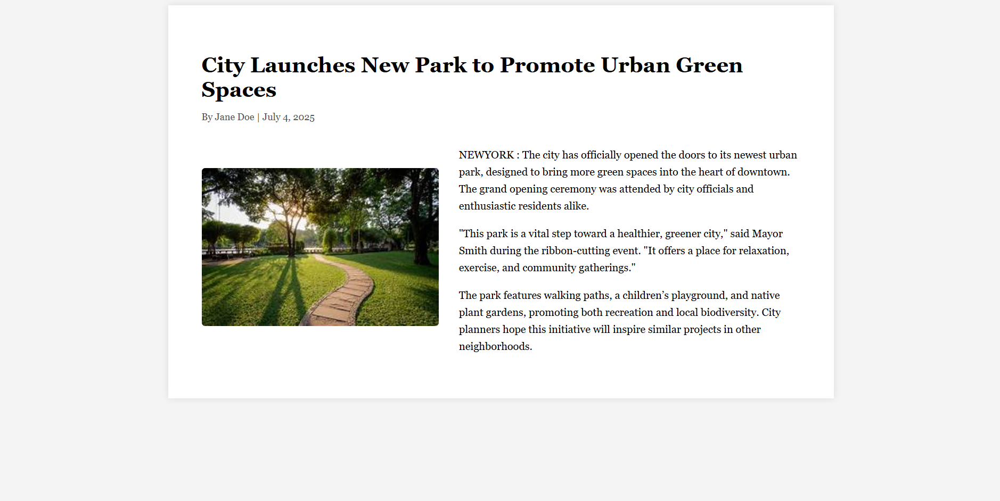

# 📰 Article Page  

A simple, clean **Article Page** built using only **HTML**.  

## 📖 Project Description  
This project was created as a **practice exercise** to strengthen my skills in **HTML structure and formatting**.  
The page represents a sample article layout with a title, author/date, image, and content paragraphs.  

The main purpose of this project is to:  
- Practice writing semantic HTML code  
- Understand how to organize text content into sections  
- Get familiar with structuring an article layout similar to blogs or news sites  

This project does **not** use CSS or JavaScript (for now). It focuses only on **HTML basics** and building a solid foundation for web development.  

---

## 🚀 Features  
- Basic article layout  
- Title and author/date section  
- Inline image inside the content  
- Structured text with paragraphs and quotes  

## 📂 Project Structure  
Article-page/
-- article.html # Main article page (HTML practice)
-- README.md # Documentation
-- Screenshot.png # Project preview (optional)

## 🛠️ Technologies Used  
- **HTML5** – for structuring the content  

## 📸 Screenshot  
  

## 💡 How to Run  
1. Clone the repository:  
   ```bash
   git clone https://github.com/Parvathy620/Article-page.git
